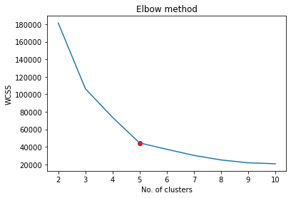
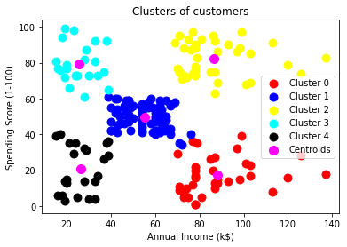

# Clustering_KMeans
### Problem:
Segregate customers into optimal clusters using mall customer Kaggle dataset and performing K-Means clustering.
### Approach:
* Understand the data.
* Use Elbow method to find optimal no. of clusters.
* Train a model using unsupervised learning algorithm (K-Means).
* Plot and characterize clusters.

Within-cluster sum of squares of distances between each point and a centroid of its cluster versus the number of clusters:

The elbow point is marked in red and shows that the optimal number of clusters is 5:

+ Cluster 3: low income, high spending.
+ Cluster 0: high income, low spending.
+ Cluster 1: majority of customers: average income and average spending.

This is the target group of customers with income from 39k to 76k inclusive and spending score from 34 to 61 inclusive.
